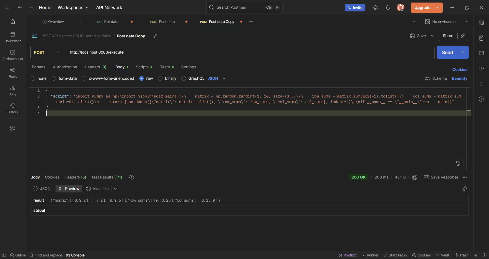
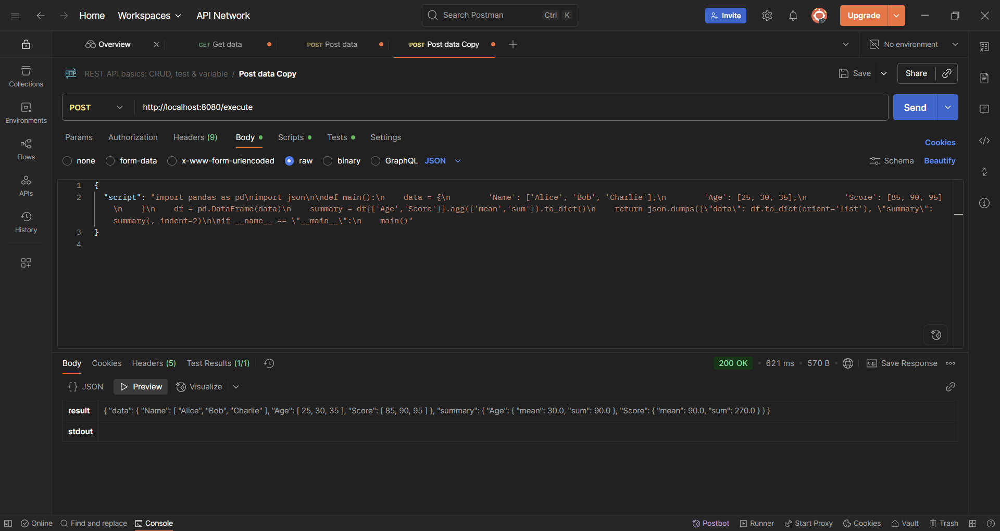
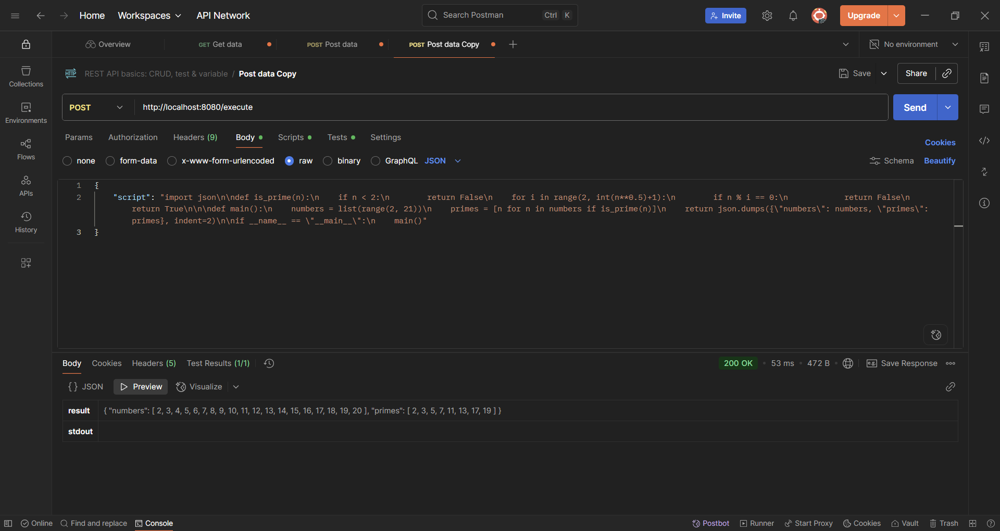
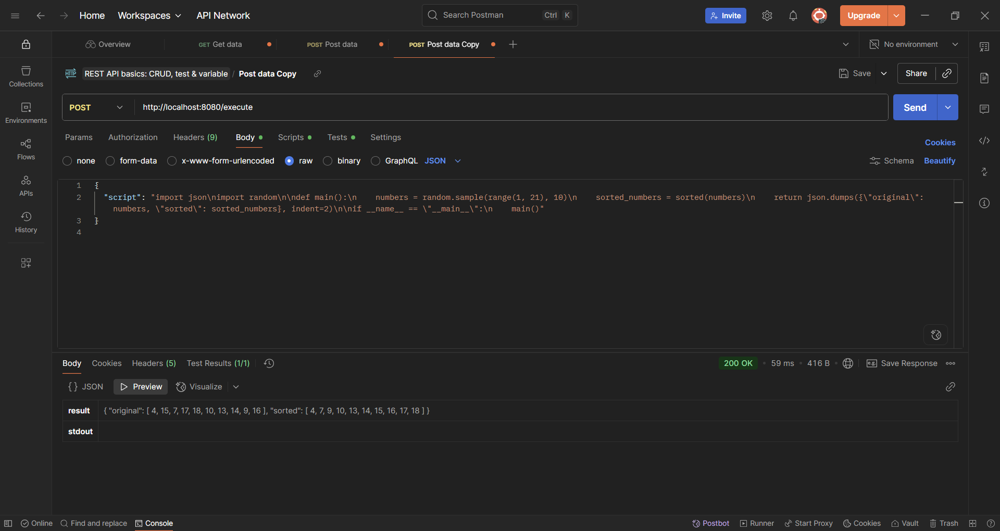
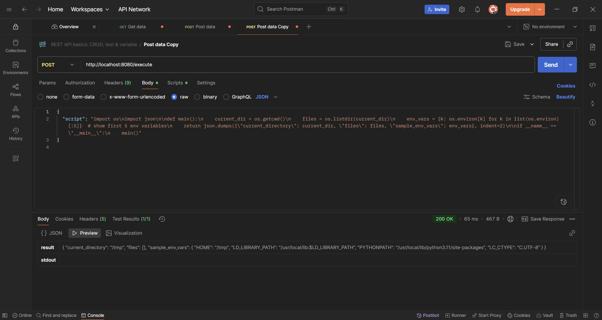

# Python Execution API with nsjail

This project provides a lightweight API for executing Python code inside a restricted environment using **nsjail**.  
The service is containerized with Docker and exposes a simple HTTP endpoint.

---

## Usage

### Run Locally (Docker)

1. Build and run the Docker container:
   ```bash
   docker build -t python-nsjail .
   docker run -p 8080:8080 python-nsjail

2. Example cURL Request:

   ```bash
   curl --location 'http://localhost:8080/execute' \
   --header 'Content-Type: application/json' \
   --data '{
     "script": "import pandas as pd\nimport json\n\ndef main():\n    data = {\n        '\''Name'\'': ['\''Alice'\'', '\''Bob'\'', '\''Charlie'\''],\n        '\''Age'\'': [25, 30, 35],\n        '\''Score'\'': [85, 90, 95]\n    }\n    df = pd.DataFrame(data)\n    summary = df[['\''Age'\'','\''Score'\'']].agg(['\''mean'\'','\''sum'\'']).to_dict()\n    return json.dumps({\"data\": df.to_dict(orient='\''list'\''), \"summary\": summary}, indent=2)\n\nif __name__ == \"__main__\":\n    main()"
   }'
   ```

3. Expected Response:

   ```json
   {
     "data": {
       "Name": ["Alice", "Bob", "Charlie"],
       "Age": [25, 30, 35],
       "Score": [85, 90, 95]
     },
     "summary": {
       "Age": { "mean": 30.0, "sum": 90.0 },
       "Score": { "mean": 90.0, "sum": 270.0 }
     }
   }
   ```

---

## Cloud Run Deployment

The application runs correctly in Docker on local machines.
However, deployment to **Google Cloud Run** is not possible due to the following error:

```
[E][2025-09-20T15:47:31+0000][8] standaloneMode():275 Couldn't launch the child process
```

This happens because **nsjail** depends on privileged kernel operations (namespace creation, mount operations), which are blocked by Cloud Run’s managed sandbox (gVisor/Gen-2). Since Cloud Run does not allow privileged containers, nsjail cannot start the jailed process, leading to the failure.

## Screenshots
  
*Figure 1: Generating a random NumPy matrix and computing the sum*  

&nbsp;  

  
*Figure 2: Creating a Pandas DataFrame and computing summary statistics*  

&nbsp;  

  
*Figure 3: Prime number checking example*  

&nbsp;  

  
*Figure 4: Sorting a collection*  

&nbsp;  

  
*Figure 5: Current working directory and environment info plotted with Matplotlib*  

